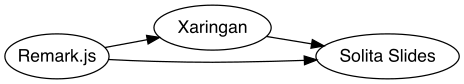
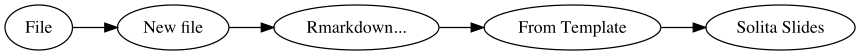

```{r setup, include = FALSE}
knitr::opts_chunk$set(
  collapse = TRUE,
  comment = "#>",
  fig.path = "man/figures/README-",
  out.width = "100%"
)
```

# Solita Slides 

This is a package to create Solita branded slides. Some of the key features are:

* Reproducabitity - Less maintaining of slides
* Interactivity - Include maps, videos, dashboards or demos in your slides

### Other great features are

* Presenter mode
* Parameters
* Export your slides to pdf
* Wide support for different programming languages, however mainly tested for R and Python
* Spend more time coding and learn more rmarkdown/css/javascript
* Support for fun effects such as snow and confetti
* Support for Parameters, allowing you leverage your work quickly


## Solita Slides are built ontop of Xaringan and Remark.js 



[Remark js](https://github.com/gnab/remark) is a javascript library, the backbone of the system to create slides.

[Xaringan](https://github.com/yihui/xaringan) is a R-package where lots of the great features come from. The main developer of Xaringan, Yihui Xie is the king of Rmarkdown.

## Installing Solita Slides

* In order to run Solita slides, you will need [R](https://cran.r-project.org/) and [Rstudio](https://www.rstudio.com/products/rstudio/)
* Install devtools if you do not have it already (remove the comment and run)
* Install the package from github

``` r
# install.packages("devtools")
devtools::install_github("Solita-jakob/solitaslides")
```


## Getting started

From within Rstudio, assuming you have installed the package, do the following:



Give your slides a name and then start the rmarkdown file and press "knit". To get more efficient with the knitting you can use the infinite moon reader as well, just like you would in Xaringan. Using this setting you only need to press "CMD+S" in order for the slides to update.


```{r, eval=FALSE}
solitaslides::inf_mr()
```


### Links - Great content

* [Info Session - presented by me (Jakob)](https://web.microsoftstream.com/video/d9abfb67-3296-4d77-b680-1d19ac941403)
* [Remark Formating](https://github.com/gnab/remark/wiki/Formatting)
* [Rmarkdown Cookbook](https://bookdown.org/yihui/rmarkdown-cookbook/html-css.html)
* [W3school/CSS](https://www.w3schools.com/cssref)
* [Infinite Moon Reader](https://yihui.org/en/2019/02/ultimate-inf-mr/)
* [Good video on Xaringan and CSS](https://www.rstudio.com/resources/rstudioglobal-2021/xaringan-playground-using-xaringan-to-learn-web-development/)


### Downsides

* There is currently no great way to export html to powerpoint
* Programming your slides might not be suitable for everyone
* Creating new templates is somewhat time consuming (but worth it and fun!)


### Example

[Example of an exported PDF](https://www.jakobj.se/fonts-solita/solitaslides.pdf)

## Credit

Thanks to Yuhui Xie and all the developers behind Xaringan, without you this project would not have existed. Thanks also to all the devs on Remark.

Thanks to my team at Solita who allows small ventures such as this one to exist.


## Contact

Send me an email: jakob.johannesson@solita.fi

Or reach out to me on Slack

Last updated `r Sys.Date()`
