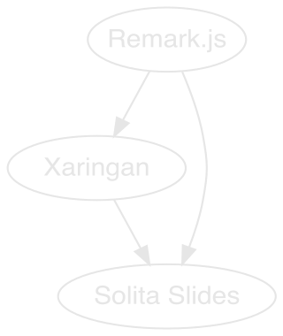

layout: true
background-color: #282828
name: right-half-image
class: padding-right-65
---
layout: true
background-color: #282828
name: left-half-image
class: padding-left-60
.solita-logomark[]
---
name: first-slide
layout: true
background-color: #DC1E32
.solita-logomark[]

---
layout: true
name: theme-red-white
class: theme-red-white

---
background-color: #DC1E32
.solita-logomark-starter[]
.solita-text[]

.header-large[Solita Slides]


???

Here you can add notes, if you want to access the notes: press "p" during the presentation. Keep in mind, you can add images, links, equations or whatever here. This is markdown aswell!

---
layout: true
class: padding-right-12
background-color: #282828
.solita-logomark[]

---
class: padding-right-45
.profile-pic[]

# Short intro about me

* Jakob Johannesson
* Data Scientist in the Swedish data unit

<br>
--

-- --

### Who have used R before?

If you have used R before: Send a ❤️ as a reaction

If you have .solita-red[not] used R before: Send a 👏 as a reaction

---
background-color: #DC1E32

# Status quo

### Where are we located right now in terms of presentations?

* Powerpoints or Google slides from the branding team
* Great templates, easy to get started
* Great support within Solita
* Great if used just once - Static content


--

### Maintaining is hard and dull
* Small changes to plots implies you need to import the entire plot
* Numbers tend to change (KPIs etc)


???

* You use Powerpoint, downloaded from Google drive and changed to fit your needs.
* The templates are beautiful and create great slides with little effort from the user
* It includes lots of pointing and clicking.
* It is easy to get started and if the presentation is just occurring once, great!
* However if you need to maintain the presentation, a whole new dimention kicks in. The maintainer of the presentation is expected to deliver a presentation every month on the new numbers that have arrived.
* Issues arise as the numbers coming in and different plots and lots of different resources needs to get added to the presentation. The maintainer feels frustrated, as a small change, such as changing the title in a plot will mean that the plot needs to get exported again and then added to the presentation, while adjusting the margins and such.
* The maintainer of the presentation feel that this is dull. It is 2021, how can we not have moved on to a smooth new solution?!
* I've talked to my college Lukas and he told me a story about a insurance company that had a full time person simply to maintain presentation slides. 


---
class: padding-right-34
template:theme-red-white
.solita-logomark-black[]

# .solita-red[Solita Slides equals less maintaining]

* Reproducability
* Embed interactive materials such as dashboards, maps, videos or even a demo.

### .solita-red[Other pros of using Solita Slides]

* If you are using Rstudio in your project, it is easy to get started with a new presentation
* Outstanding if you already know how to use rmarkdown or css
* Support for parameters, more on this on the next slide.
* Export your slides to PDF
* Wide support for different programming languages
* Great presenter mode
* Support for fun effects such as snow and confetti

.solita-hex[]

???

Reproducability: Content is attached to the code, if you have new code or new data it is just a click away. No more copy paste.

You don't need to use R in order to use Rmarkdown!


---

# Parameters

A great way to gain heavy leverage in slide creation is to use parameters. This way you use your database in a super efficient way. Simple uses for this might be to change the color on all slides or change the logo on all the slides. Or adding a boolean for including some slides and excluding others.

### Infinite moonreader

Allows you to write code and the results will show instantly in the viewer panel. GIF on next slide.
---
.cropped[]
.solita-logomark-black[]

---
class: padding-right-25
# Save your slides to PDF

* You can simply add it to the final slide and it will save your slides every time.
* If have lots of slides you can disable it and only run it when you need it.

Example:

```{bash, eval=FALSE}
`npm bin`/decktape remark file:///Users/input.html output.pdf 
--chrome-arg=--disable-web-security --size 1600x900
```

### What you need

* Node.js
* Decktape (github)
* Change the command above to your project
---

# Wide support for different programmering languages

* R
* Python
* CSS
* Javascript
* SQL
* Bash
* etc

---

# Presenter mode

If you want to access the notes, press "P".

If you want to get a external browser of your slides, press "C", use this with the presenter mode to present just like Google slides or Powerpoint.


???

Here are your secret notes! You can include anything in here, such as images, gifs, videos, shinyapps, secret equations or just simple and _great notes_.

The secret to creating slides is to use the R-package Xaringan. In Xaringan there is a function called Infinite Moonreader and you can use this to create slides with your output showing up as you write it!

Infinite moonreader does not work if you have parameter elements.

---

# Support for fun effects!

Add snow, confetti or some other effect to your slides, as a way to engage your audiance!

If you are waiting for someone, add a javascript that lets snow fall down and gives the slides more life. Create a toggle so you can turn it on and off with ease!

If you are celebrating someone, send some confetti to the slides as a way to truly celebrate. TADA!

Use "T" to activate snow and press "R" to disable it.

Does not work with pdf.


---
# Powerpoint vs Solita Slides

Some differences between using Powerpoint (left) and using Solita Slides (right):

.pull-left[
### Powerpoint

1. Use a template from Google drive

1. Find slides that fit your needs

1. Use modify the presentation

1. Manually change pictures, update numbers

1. Lots of copy and paste for plots that need updates

1. Keeping track of versions is hard
]

.pull-right[
### Solita Slides

1. Start with an R Markdown document

1. R Markdown (can embed R/other code chunks)

1. Use the slides that interest you and fit your needs

1. Use CSS to create beautiful slides

1. Code is within the slides, copy and paste is not needed.

1. Keeping track of versions is easy
]

---
background-color: #DC1E32
class: padding-right-45


```{r, echo=FALSE, message=FALSE, warning=FALSE}
library(DiagrammeR)
library(DiagrammeRsvg)
library(tidyverse)
library(rsvg)


grViz('digraph{
      Remark->Xaringan;
      Remark->SolitaSlides;
      Xaringan->SolitaSlides;}') %>%         
  export_svg() %>%
  str_replace_all(pattern = "#ffffff",replacement = "transparent") %>% 
  str_replace_all(pattern = "#000000",replacement = "#E6E6E6") %>% 
  str_replace_all(pattern = "Remark",replacement = "Remark.js") %>% 
  str_replace_all(pattern = "Times,serif",replacement = "Century Gothic bold") %>% 
  str_replace_all(pattern = "SolitaSlides",replacement = "Solita Slides") %>%
  charToRaw %>%
  rsvg_svg("images/digraph.svg",height = 380,width = 320)

```

.digraph[]

## How did we get here?

* Remark.js is the orgin, with the complex javascripts running in the backend.
* Xaringan is a R-package that allows you to create slides with Remark. Includes a basic template that can be used for slides.
* Solita Slides - a modified Xaringan template. This time using the colors, fonts, images and logos of Solita. Includes examples.


---

# How to get started

* Download the package

### Run this in Rstudio


```{r, eval=FALSE}
# install.packages("devtools")  # If you don't have devtools
devtools::install_github("Solita-Jakob/solitaslides")
```


* A new template will appear under "file>new file>Rmarkdown...>New template>Solita Slides", give it a name and run it.
* Change the slides to your needs

### More on the topic

Check out the github to read more about getting started with the package and [watch the info session for a demo on the topic](https://web.microsoftstream.com/video/d9abfb67-3296-4d77-b680-1d19ac941403).


---
.full-size-image[]
---
template: left-half-image
.left-half-image[]


# Image on the left hand side

1. You can add images on different sides of the slides
1. This template is called "left-half-image" and you need to use it with the "left-half-image"-class in order to add a picture to the side.
1. As the text is on the right hand side, the logomark is not a issue

---
template: theme-red-white
class: padding-right-60
.right-half-image[] 
.solita-logomark[]


### .solita-red[Slides work similar to how layers work in Photoshop]

Templates are always layer one. Images are above this template layer and can cause the logomark to be covered since the logomark is behind the image. In this case you will need to add another logo.

---
template: left-half-image
class: padding-left-70
.solita-logomark[]

.wood[]
.middle-bar[]
.top-number[1.]
.middle-number[2.]
.bottom-number[3.]

Using this presentation template, you can create great slides with low effort. Test it!

<br>

Since the template for most pictures and setups are already done, you can just copy one.

<br>
<br>

Test it yourself!


---
class: padding-left-62
.fireflies[]


### Sample slide

This slide was just to nice to be removed.


---
background-color: #E6E6E6
class: solita-black, ggplot-text
.solita-logomark-black[]

```{r,echo=FALSE, message=FALSE, include=FALSE}
require(RColorBrewer)
library(ggplot2)
library(extrafont)
# font_import()
fonts()
mtcars$Gear<-as.factor(mtcars$gear)

ggplot(mtcars, aes(cyl,mpg))+
  geom_point(aes(color=Gear),size=5)+ theme_bw() +
  labs(x = "Cylinders",
       y = "Miles per\ngallon",
       title = "Relationship between MPG and cylinder count")+ 
  scale_fill_manual(name = "Utbildningsnivå",                    
                    values = brewer.pal(n = 3,
                                        name = "Dark2"))+
  scale_y_continuous(limits = c(0,40),breaks = seq(0,40,10))+
  scale_x_continuous(limits = c(4,8),breaks = seq(4,8,2))+
  theme(axis.title.y =                              
          element_text(),              
        plot.title =                              
          element_text(hjust = 0.722,size = 40, face = "bold",family = "Century Gothic"),
        panel.grid.major.x =                    
          element_blank(),                         
        panel.grid.minor.x =                       
          element_blank(),
        panel.grid.major.y =                       
          element_line(color = "#505050",size=0.1),
        legend.title = element_text(color = "#282828", size = 27,family = "Century Gothic"),
        legend.text = element_text(color = "#282828", size = 27,family = "Century Gothic"),
        axis.title.x.bottom = 
          element_text(size =30,face = "bold",family = "Century Gothic"),
        axis.title.y.left = 
          element_text(size =30,face = "bold",family = "Century Gothic",angle = 0,vjust = 0.5, hjust=0.5),
        axis.text.x.bottom = 
          element_text(size=27),
        axis.text.y.left =  
          element_text(size=27),
  panel.background = element_rect(fill = "#E6E6E6",
                                colour = "#E6E6E6",
                                size = 0.5, linetype = "solid"),
  panel.grid.major = element_line(size = 0.5, linetype = 'solid',
                                colour = "#E6E6E6"), 
  panel.grid.minor = element_line(size = 0.25, linetype = 'solid',
                                colour = "#E6E6E6"),
    plot.background = element_rect(fill = "#E6E6E6",
                                   color= "#E6E6E6"),
    legend.background = element_rect(fill="#E6E6E6",
                                     color="#E6E6E6"),
  legend.key = element_rect(fill = "#E6E6E6", color = NA),
  legend.key.size = unit(1, "cm"),
  legend.key.width = unit(0.5,"cm"))


ggsave("images/ggplot-figure.jpeg",device = "jpeg",width = 12.8,height = 7.2,units = "in")


```

.ggplot-figure[]

<br>

* The code will run everytime the slides are rendered.
* This example is rendering the image, saving it to the disk and then loading it in order to easier formating in it the presentation. It is possible to add picture directly aswell, however formating it might be tougher.

---
background-color: #E6E6E6
class: padding-right-55, theme-red-white


.globe[]
.solita-logomark[]
.red-bar[]
.white-bar1[]
.white-bar2[]
.white-bar3[]

```{r, include=FALSE,message=FALSE,echo=FALSE}
library(rvest)
library(stringr)

if(params$webscrape){
  # We want to avoid scraping to much, so this is not run by default
  # Swedish stock market index
omxs30_site<-read_html("https://www.avanza.se/index/om-indexet.html/19002/omx-stockholm-30") %>% 
  html_nodes(".roundCorners3")

omxs30<-omxs30_site %>% html_text() %>% 
  str_remove_all("\\s") %>% str_replace_all(pattern = ",",replacement = ".")  %>% 
  as.numeric() %>% round(digits = 1)
omxs30_update<-omxs30_site %>% html_attr("title") %>% str_split(pattern = "\\s") %>% pluck(3) %>% unlist()

# Finnish stock market index

omxh25_site<-read_html("https://www.avanza.se/index/om-indexet.html/53295/omx-helsinki-25") %>% 
  html_nodes(".roundCorners3")
omxh25<-omxh25_site %>% html_text() %>% 
  str_remove_all("\\s") %>% str_replace_all(pattern = ",",replacement = ".")  %>% 
  as.numeric() %>% round(digits = 1)
omxh25_update<-omxh25_site %>% html_attr("title") %>% str_split(pattern = "\\s") %>% pluck(3) %>% unlist()

# Exchange rate EUR/USD (spot)

EURSEK<-read_html("https://www.avanza.se/index/om-indexet.html/18998/eur-sek") %>% 
  html_nodes(".roundCorners3") %>% html_text() %>% 
  str_remove_all("\\s") %>% str_replace_all(pattern = ",",replacement = ".")  %>%
  as.numeric() %>% round(digits = 2)

# Exchange rate EUR/USD (spot)
EURUSD<-read_html("https://www.avanza.se/index/om-indexet.html/18987/eur-usd") %>% html_nodes(".roundCorners3") %>% html_text() %>% 
  str_remove_all("\\s") %>% str_replace_all(pattern = ",",replacement = ".")  %>%
  as.numeric() %>% round(digits = 2)
} else {
  
  omxs30 <- 2244.6
  omxs30_update <- "09:39:40"
  omxh25 <- 5176.7
  omxh25_update <- "09:39:51"
  EURSEK <- 10.13
  EURUSD <- 1.22
}
```

.title-bar1[`r omxs30`]
.text-bar1[OMXS30: `r omxs30_update`]
.title-bar2[`r omxh25`]
.text-bar2-alt[[Finnish market](https://www.avanza.se/index/om-indexet.html/53295/omx-helsinki-25)]
.title-bar3[`r EURUSD`]
.text-bar3-alt[EUR/USD]
.title-bar4[`r EURSEK`]
.text-bar4[EUR/SEK]
.header-large2[Dynamic numbers in the presentation]


* Lets say you have a few KPI:s
* You want to know what the [Swedish stock market index](https://www.avanza.se/index/om-indexet.html/19002/omx-stockholm-30) is trading at right now.
* We can scrape a website in order to gain this insight, currently the market is trading at: `r omxs30` and this number was updated at `r omxs30_update`. 15 min delay.
* The Finnish market (OMXH25?) might be of interest aswell!

---

# Shiny apps can be included 🔥

<iframe id="example1" src="https://gallery.shinyapps.io/goog-trend-index/" style="border: none; width: 100%; height: 500px" frameborder="0">
</iframe>

---

# Videos can be embedded 🔥

<iframe width="100%" height="500px" src="https://www.youtube.com/embed/p2zWaCa_haA" title="YouTube video player" frameborder="0" allow="accelerometer; autoplay; clipboard-write; encrypted-media; gyroscope; picture-in-picture" allowfullscreen></iframe>

---

# Resources used

* [W3school/CSS](https://www.w3schools.com/cssref)
* [Rmarkdown Cookbook](https://bookdown.org/yihui/rmarkdown-cookbook/html-css.html)
* [Infinite Moon Reader](https://yihui.org/en/2019/02/ultimate-inf-mr/)
* [Good video on Xaringan and CSS](https://www.rstudio.com/resources/rstudioglobal-2021/xaringan-playground-using-xaringan-to-learn-web-development/)
* [Remark Formating](https://github.com/gnab/remark/wiki/Formatting)


---
exclude: true

# This slide simply prints the presentation - and is excluded from the presentation

* It is using decktape to print it, you will need it first in order to use this code chunks
* It will be screaming with errors since you have html iFrames that cannot be printed to html, therefore we will need to use error=TRUE. Eval is set to FALSE since it is heavy for the computer to run this.

```{bash, eval=FALSE}
`npm bin`/decktape remark <PATH TO YOUR HTML PRESENTATION> output.pdf --chrome-arg=--disable-web-security --size 1600x900

# Example
`npm bin`/decktape remark file:////Users/Presentation/skeleton/skeleton.html solitaslides.pdf --chrome-arg=--disable-web-security --size 1600x900
```